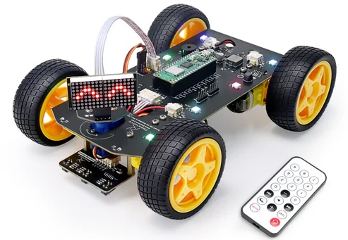
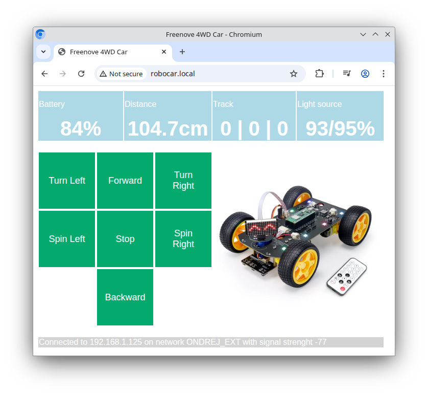

# Freenove 4WD car control
Micropython software for controlling the [Freenove 4WD car kit with RPi Pico](https://store.freenove.com/products/fnk0089)

[Freenove](https://freenove.com/) provides low cost robotic kits for educational purpose which run on popular microcontroller modules. The hardware is well documented and example C code is provided for hardware drivers and control logic.

This repository is intended to provide a Micropython implementation for the **[Freenove 4WD Car Kit](https://docs.freenove.com/projects/fnk0089/en/latest/)** powered by the [RPi Pico-W](https://www.raspberrypi.com/products/raspberry-pi-pico/). It is still work in progress and features might be added in the future.

Any contribution is welcome.

## Features

### Device drivers 

Hardware device drivers are provided as Python classes for the following devices.

* [DC Motor](https://docs.freenove.com/projects/fnk0089/en/latest/fnk0089/codes/Standard/2_Module_test_.html#motor)
* [Servo motor](https://docs.freenove.com/projects/fnk0089/en/latest/fnk0089/codes/Standard/2_Module_test_.html#servo)
* [Battery monitor](https://docs.freenove.com/projects/fnk0089/en/latest/fnk0089/codes/Standard/2_Module_test_.html#adc-module)
* [Neopixel LED strip](https://docs.freenove.com/projects/fnk0089/en/latest/fnk0089/codes/Standard/2_Module_test_.html#led)
* [Ultrasonic sensor module](https://docs.freenove.com/projects/fnk0089/en/latest/fnk0089/codes/Standard/3_Ultrasonic_Obstacle_Avoidance_Car.html#ultrasonic-module)
* [Track sensor module](https://docs.freenove.com/projects/fnk0089/en/latest/fnk0089/codes/Standard/5_Line_Tracking_Car.html#line-tracking-sensor)
* [Light sensor](https://docs.freenove.com/projects/fnk0089/en/latest/fnk0089/codes/Standard/4_Light_Tracing_Car.html#photoresistor-adc)
* [Buzzer](https://docs.freenove.com/projects/fnk0089/en/latest/fnk0089/codes/Standard/2_Module_test_.html#buzzer)
* RPi Pico Led
* [LED matrix module](https://docs.freenove.com/projects/fnk0089/en/latest/fnk0089/codes/Standard/2_Module_test_.html#led-matrix) (*TODO*)
* [IR Remote control](https://docs.freenove.com/projects/fnk0089/en/latest/fnk0089/codes/Standard/6_Infrared_Car.html#introduction-of-infrared-reception-function) (*TODO*)

### Remote Web GUI

For remote control and monitoring of the car over the local Wifi network, an integrated web server provides a simple Web GUI which can be used on a PC or smart phone. The web server is based on the  [Microdot](https://github.com/miguelgrinberg/microdot) framework, using web sockets. 

### Autonomous car movement

It is planned to implement some logic to enable the car to move around autonomously, avoiding obstacles, finding the shortest path from A to B, controlling the speed, following the light, ecc.
